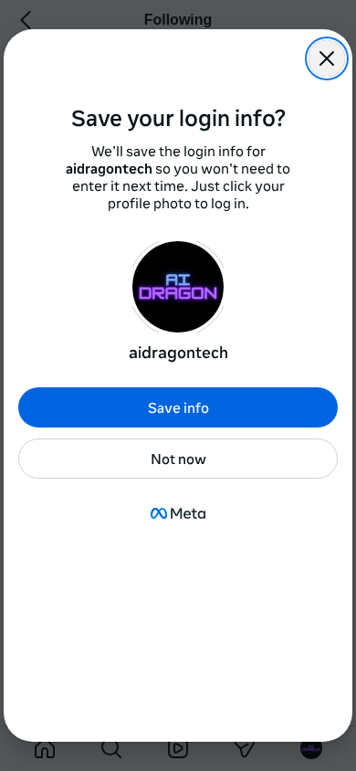

# 🚨 INCIDENT REPORT: Scraping Failed for @lennart_kl10
**Datum:** 1/31/2026, 5:38:50 PM
**Status:** FAILED
**Grund:** Nur 3.3% gescrapt

## 📊 Statistik
- **Erwartet:** 369
- **Gescrapt:** 12
- **Quote:** 3.3% (Limit: 95.0%)
- **Viewport:** Mobile (iPhone 12 Pro)

## 📸 Letzter Zustand

## 📝 Analyse-Log
- Retry-Versuche: 3
- Strategien: js-scroll, keyboard, mouse-wheel
- Letzte Screenshots: agent-debug-lennart_kl10-profile-1769881078896.png, agent-debug-lennart_kl10-after-click-check-1769881083974.png, agent-debug-analysis-1769881125660.png

---
*Dieser Report wurde automatisch vom Self-Healing Agenten erstellt.*
